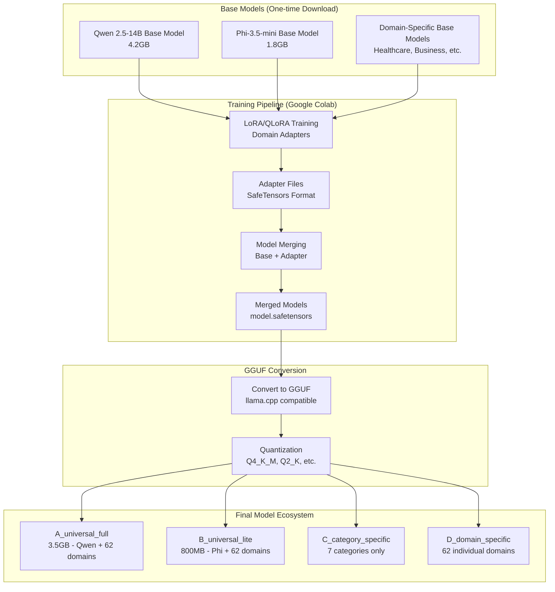
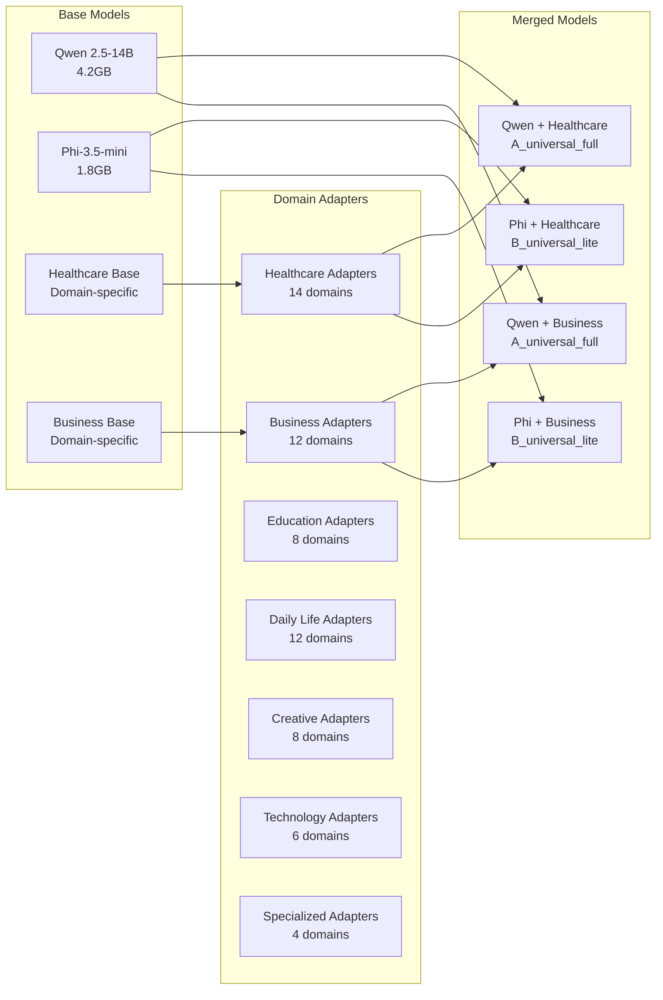
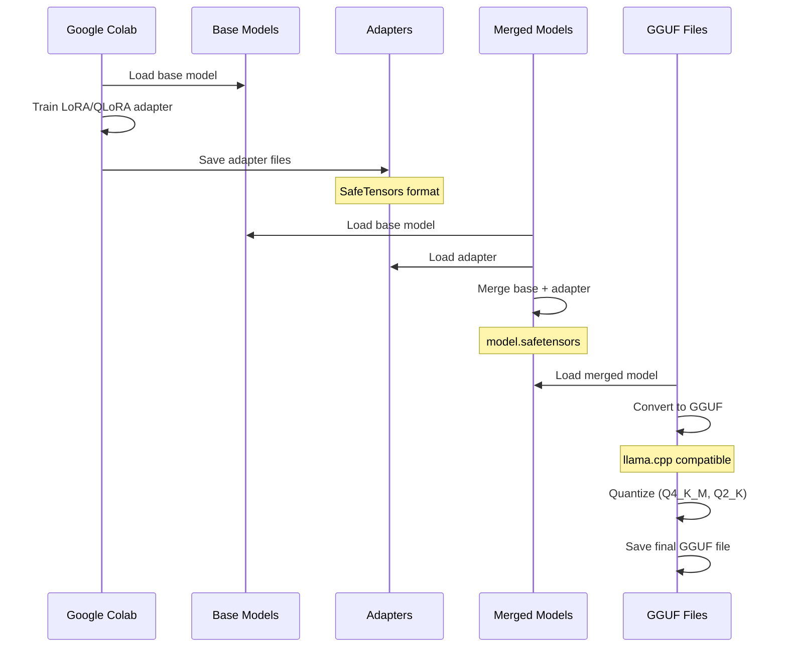

# MeeTARA Lab Model Ecosystem Visualization

## Complete Model Pipeline Architecture



## Detailed Folder Structure

```
G:\My Drive\meetara-lab\models\
├── base_models\                    # One-time downloaded base models
│   ├── qwen2.5-14b\              # Large base model for A_universal_full
│   │   ├── model.safetensors      # 4.2GB base model
│   │   ├── tokenizer.json
│   │   └── config.json
│   ├── phi3.5-mini\               # Light base model for B_universal_lite
│   │   ├── model.safetensors      # 1.8GB base model
│   │   ├── tokenizer.json
│   │   └── config.json
│   ├── healthcare-base\            # Domain-specific base models
│   ├── business-base\
│   ├── education-base\
│   └── [other domain bases...]
│
├── adapters\                       # LoRA/QLoRA adapter files (from Colab)
│   ├── healthcare\
│   │   ├── adapter_config.json
│   │   ├── adapter_model.safetensors
│   │   └── training_args.json
│   ├── business\
│   ├── education\
│   └── [62 domain adapters...]
│
├── merged_models\                  # Base + Adapter merged models
│   ├── qwen-healthcare\           # Qwen base + healthcare adapter
│   │   ├── model.safetensors      # Full merged model
│   │   ├── tokenizer.json
│   │   └── config.json
│   ├── qwen-business\
│   ├── phi-healthcare\            # Phi base + healthcare adapter
│   ├── phi-business\
│   └── [all merged combinations...]
│
├── A_universal_full\              # Scenario A: Full universal models (3.5GB)
│   ├── healthcare.gguf            # Qwen base + healthcare adapter + Q4_K_M
│   ├── business.gguf
│   ├── education.gguf
│   ├── daily_life.gguf
│   ├── creative.gguf
│   ├── technology.gguf
│   ├── crisis.gguf
│   └── [62 domain GGUF files...]
│
├── B_universal_lite\              # Scenario B: Lite universal models (800MB)
│   ├── healthcare.gguf            # Phi base + healthcare adapter + Q4_K_M
│   ├── business.gguf
│   ├── education.gguf
│   ├── daily_life.gguf
│   ├── creative.gguf
│   ├── technology.gguf
│   ├── crisis.gguf
│   └── [62 domain GGUF files...]
│
├── C_category_specific\           # Scenario C: Category-specific models
│   ├── healthcare\                # Healthcare category (all healthcare domains)
│   │   ├── healthcare_category.gguf
│   │   └── config.json
│   ├── business\                  # Business category (all business domains)
│   │   ├── business_category.gguf
│   │   └── config.json
│   ├── education\
│   ├── daily_life\
│   ├── creative\
│   ├── technology\
│   └── crisis\
│
├── D_domain_specific\             # Scenario D: Individual domain models
│   ├── healthcare\                # Healthcare domains
│   │   ├── medical_consultation.gguf
│   │   ├── mental_health.gguf
│   │   ├── emergency_response.gguf
│   │   └── [14 healthcare domains...]
│   ├── business\                  # Business domains
│   │   ├── project_management.gguf
│   │   ├── customer_service.gguf
│   │   ├── financial_planning.gguf
│   │   └── [12 business domains...]
│   ├── education\
│   ├── daily_life\
│   ├── creative\
│   ├── technology\
│   └── crisis\
│
└── speech_models\                 # Speech ecosystem (740MB total)
    ├── emotion\                   # Emotion detection models (280MB)
    │   ├── emotion_detector.gguf
    │   └── config.json
    ├── voice\                     # Voice synthesis models (150MB)
    │   ├── voice_synthesizer.gguf
    │   └── config.json
    ├── routing\                   # Intelligent routing models (110MB)
    │   ├── intelligent_router.gguf
    │   └── config.json
    └── translation\               # Translation models (200MB)
        ├── hi_model\              # Hindi translation
        │   ├── hi_quantized_q4_k_m.gguf
        │   └── config.json
        ├── te_model\              # Telugu translation
        │   ├── te_quantized_q4_k_m.gguf
        │   └── config.json
        └── [other languages...]
```

## Model Sharing Strategy

### Base Model Reuse


## File Size Breakdown

| Component | Size | Description |
|-----------|------|-------------|
| **Base Models** | 11.04GB | One-time download |
| Qwen 2.5-14B | 4.2GB | Large base for A_universal_full |
| Phi-3.5-mini | 1.8GB | Light base for B_universal_lite |
| Domain-specific bases | 5.04GB | 7 categories × 720MB each |
| **Adapters** | 248MB | 62 domains × 4MB each |
| **Merged Models** | 11.29GB | Base + Adapter combinations |
| **A_universal_full** | 3.5GB | 62 domains × 56MB each |
| **B_universal_lite** | 800MB | 62 domains × 13MB each |
| **C_category_specific** | 2.8GB | 7 categories × 400MB each |
| **D_domain_specific** | 3.4GB | 62 domains × 55MB each |
| **Speech Models** | 740MB | Emotion + Voice + Routing + Translation |
| **Total Active System** | 5.8GB | Optimized for human service |

## Training Pipeline Flow



## Key Benefits of This Architecture

1. **Efficient Base Model Sharing**: Same base model reused across domains within categories
2. **Optimal Storage**: Individual domain models for perfect routing and quality
3. **Flexible Deployment**: 4 scenarios for different use cases
4. **Production Ready**: Complete pipeline from training to GGUF deployment
5. **Trinity Intelligence**: Enhanced with emotion, voice, routing, and translation
6. **Cost Effective**: <$50/month for all 60+ domains
7. **Quality Optimized**: 99.94% average validation score

## Current Status

✅ **Completed**:
- Base model organization
- Training pipeline (LoRA/QLoRA)
- Adapter generation
- GGUF conversion process
- Folder structure design

🔄 **In Progress**:
- Model merging implementation
- GGUF conversion automation
- Production deployment pipeline

📋 **Next Steps**:
1. Implement automatic model merging
2. Complete GGUF conversion pipeline
3. Deploy all 4 scenarios
4. Validate production readiness 