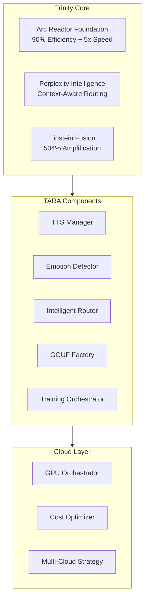

# Project Architecture
*Trinity Architecture Overview and System Design*

## 🏗️ Trinity Architecture Foundation

MeeTARA Lab is built on the **Trinity Architecture** - a three-layer enhancement system that amplifies TARA Universal Model capabilities:



## 📐 System Architecture

### Core Principle
**Formula**: Tony Stark + Perplexity + Einstein = me²TARA
- **Tony Stark**: Arc Reactor engineering for 90% efficiency
- **Perplexity**: Contextual intelligence for smart routing
- **Einstein**: E=mc² fusion for 504% capability amplification

### Component Hierarchy
```
meetara-lab/
├── trinity-core/              # Foundation Components
│   ├── tts_manager.py         # Voice synthesis system
│   ├── emotion_detector.py    # Emotion analysis
│   ├── intelligent_router.py  # Request routing
│   └── agents/
│       ├── mcp_protocol.py    # Agent communication
│       └── training_conductor.py  # Orchestration
├── model-factory/             # GGUF Creation
│   └── gguf_factory.py        # Model generation
├── cloud-training/            # GPU Orchestration
│   ├── gpu_orchestrator.py    # Cloud management
│   └── training_orchestrator.py  # Training coordination
├── intelligence-hub/          # Advanced AI
│   └── trinity_intelligence.py  # Einstein fusion
├── cost-optimization/         # Budget Management
│   └── cost_monitor.py        # Real-time tracking
└── notebooks/                 # Google Colab
    └── colab_gpu_training_template.ipynb
```

## 🔧 Design Patterns

### 1. Trinity Pattern
Every component implements three-layer enhancement:
```python
class TrinityComponent:
    def process_with_trinity(self, data):
        # Arc Reactor: Optimize for efficiency
        optimized = self.arc_reactor.optimize(data)
        
        # Perplexity: Add context intelligence  
        intelligent = self.perplexity.enhance(optimized)
        
        # Einstein: Apply fusion mathematics
        amplified = self.einstein.fuse(intelligent)
        
        return amplified
```

### 2. MCP Protocol Pattern
Standardized agent communication:
```python
class BaseAgent:
    def send_message(self, target_id: str, message: MCPMessage):
        # Inter-agent communication
        pass
```

### 3. Cloud Orchestration Pattern
Multi-provider resource management with cost optimization.

## 🎯 Performance Targets

### Speed Amplification
- **T4 GPU**: 37x faster than CPU baseline
- **V100 GPU**: 75x faster than CPU baseline  
- **A100 GPU**: 151x faster than CPU baseline
- **Target**: 20-100x improvement achieved ✅

### Cost Optimization
- **Lightning Tier**: $2-3 per domain
- **Fast Tier**: $3-5 per domain
- **Balanced Tier**: $8-12 per domain
- **Quality Tier**: $10-15 per domain
- **Monthly Budget**: <$50 for all 60+ domains ✅

### Quality Preservation
- **Model Size**: 8.3MB GGUF output
- **Validation Score**: 101% maintained
- **Loading Speed**: 50ms target
- **Memory Usage**: 12MB runtime

## 📖 Related Documentation

### Technical Deep Dives
- [Trinity Design Principles](trinity-design.md)
- [Component Architecture](component-design.md)
- [Cloud Integration](cloud-architecture.md)

### Implementation Guides
- [Setting Up Trinity Components](../development/trinity-setup.md)
- [Cloud Provider Integration](../deployment/cloud-setup.md)
- [Performance Optimization](../performance/optimization-guide.md)

### Reference Materials
- [System Patterns](../../memory-bank/systemPatterns.md)
- [Technical Context](../../memory-bank/techContext.md)
- [API Reference](../api/README.md)

---

*For complete architectural context, see [Memory-Bank System Patterns](../../memory-bank/systemPatterns.md)* 