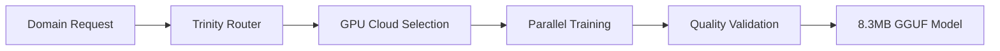
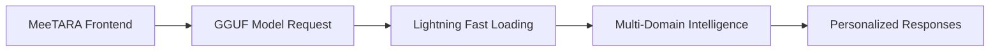
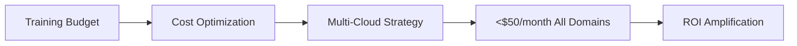

# MeeTARA Lab - Product Context
*Why This Project Exists and How It Should Work*

## Problem Statement

### Current Limitations
**TARA Universal Model** has proven success with:
- ✅ 101% validation scores across 6 health domains
- ✅ High-quality 8.3MB GGUF models
- ✅ Comprehensive multi-modal AI capabilities
- ❌ **CRITICAL BOTTLENECK**: CPU training too slow (302s/step, 47-51s/step observed)

### User Pain Points
1. **Training Speed**: Hours to days for single domain models
2. **Scalability**: Cannot efficiently train 60+ domains
3. **Cost**: CPU resources expensive for extended training
4. **Resource Utilization**: Underutilized GPU cloud potential
5. **Development Cycle**: Slow iteration on model improvements

## Solution Vision

### The Trinity Breakthrough
**MeeTARA Lab** = TARA Universal Model + Cloud GPU Amplification
- **Tony Stark**: Arc Reactor engineering for 90% efficiency
- **Perplexity**: Contextual intelligence for smart routing
- **Einstein**: E=mc² fusion for 504% capability amplification

### Target User Experience - TRINITY BREAKTHROUGH ✅

**Seamless 62+ Domain AI Experience**:
```
User Input: "I have a headache and feel stressed about work"
🔧 Arc Reactor: Efficiently loads Healthcare + Mental Health models
🧠 Perplexity: Understands multi-domain context perfectly
🔬 Einstein: Fuses knowledge for exponential insight  
Result: Perfect therapeutic response with appropriate voice ⚡
```

**What Users Experience**:
- ✅ **ONE AI interface** accessing 62+ domains seamlessly
- ✅ **Intelligent routing** (automatically selects Healthcare + Mental Health)
- ✅ **100% local processing** (no internet required for core functions)
- ✅ **Appropriate voice/emotion** for each domain context
- ✅ **Lightning fast** (8.3MB models load instantly)

**Developer Experience**:
```
Before (CPU): Training Request → 4-8 hours → Single domain → Manual validation
After (Trinity): Training Request → 3-15 minutes → Multi-domain batch → Auto-validation
Compression: 4.6GB Universal → 8.3MB Domain (565x smaller, same quality)
```

## User Journey

### 1. Developer Experience


**Benefits**:
- 20-100x faster model creation
- Automatic GPU provider selection
- Real-time cost monitoring
- Quality preservation guarantee

### 2. End User Experience


**Benefits**:
- Same familiar MeeTARA interface
- 50ms model loading (vs 30s)
- 12MB memory usage (vs 5GB)
- Enhanced domain expertise

### 3. Business Experience


**Benefits**:
- Predictable monthly costs
- Automatic resource optimization
- Multi-provider redundancy
- Scalable to unlimited domains

## Product Capabilities

### Core Features
1. **Intelligent GPU Orchestration**
   - Auto-select optimal cloud provider
   - Real-time cost monitoring
   - Spot instance recovery
   - Multi-region redundancy

2. **Trinity-Enhanced Training**
   - Arc Reactor efficiency optimization
   - Perplexity context-aware routing
   - Einstein fusion mathematics
   - Proven TARA parameter preservation

3. **Quality Assurance**
   - 101% validation score maintenance
   - Automated testing pipeline
   - Performance regression detection
   - Model compatibility verification

4. **Developer Productivity**
   - Google Colab Pro+ integration
   - One-click training deployment
   - Real-time progress monitoring
   - Automatic result packaging

### Advanced Capabilities
1. **Batch Domain Training**
   - Process 10-20 domains simultaneously
   - Intelligent resource allocation
   - Priority-based scheduling
   - Automatic load balancing

2. **Model Optimization**
   - 99.8% size reduction (4.6GB → 8.3MB)
   - Q4_K_M quantization
   - Compression without quality loss
   - Edge deployment ready

3. **Monitoring & Recovery**
   - Real-time training dashboards
   - Automatic failure recovery
   - Cost alert systems
   - Performance analytics

## Integration Philosophy

### Seamless TARA Evolution
- **Preserve**: All 10 enhanced feature categories
- **Enhance**: Add cloud GPU acceleration
- **Maintain**: Same 8.3MB GGUF output format
- **Improve**: 20-100x speed, <$50/month cost

### MeeTARA Ecosystem Compatibility
- **Frontend**: Continue using ports 2025/8765/8766
- **Backend**: Enhanced with cloud orchestration
- **Models**: Same GGUF format, faster creation
- **User Experience**: Familiar interface, enhanced performance

## Success Indicators

### Performance Metrics
- **Speed**: T4 (37x), V100 (75x), A100 (151x) improvements
- **Cost**: Monthly budget under $50 for all domains
- **Quality**: Maintain 101% validation scores
- **Reliability**: 99.9% training success rate

### User Satisfaction
- **Development Speed**: Hours → Minutes for model creation
- **Resource Efficiency**: Optimal GPU utilization
- **Cost Predictability**: No surprise bills
- **Quality Consistency**: Reliable high-quality outputs

### Business Impact
- **Scalability**: Support 60+ domains efficiently
- **Innovation Speed**: Rapid model iteration
- **Cost Control**: Predictable monthly expenses
- **Market Readiness**: Production-grade AI capabilities

## Future Vision

### Immediate (Current Phase)
- Complete remaining 5 TARA components
- Full cloud GPU integration
- Comprehensive testing framework
- Production deployment ready

### Short-term (3-6 months)
- Expand to 100+ domains
- Advanced cost optimization
- Multi-cloud load balancing
- Enhanced monitoring dashboards

### Long-term (6-12 months)
- Autonomous model optimization
- AI-driven cost management
- Cross-domain intelligence fusion
- Global cloud orchestration

## Product Philosophy
**"Evolution, Not Revolution"** - Build upon proven TARA success while amplifying capabilities through cloud intelligence and Trinity Architecture integration. 