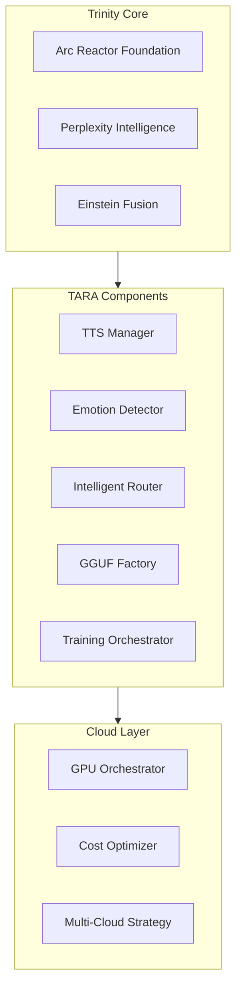
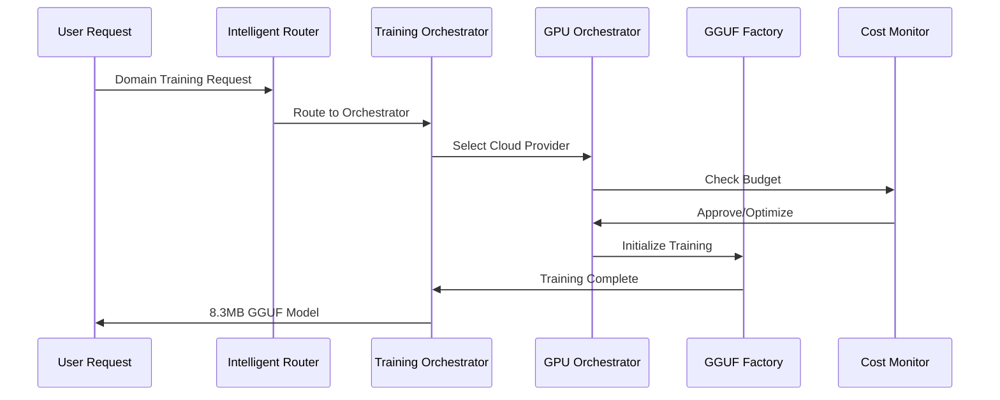
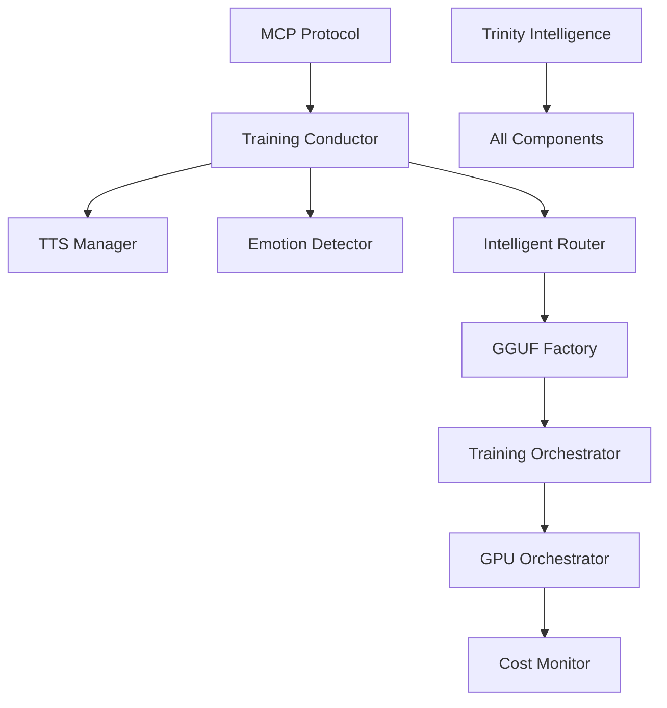

# MeeTARA Lab - System Patterns
*System Architecture and Design Patterns*

## Architecture Overview

### Trinity Architecture Foundation


### Component Hierarchy
```
meetara-lab/
├── trinity-core/              # Foundation Components
│   ├── tts_manager.py         # Voice synthesis system
│   ├── emotion_detector.py    # Emotion analysis
│   ├── intelligent_router.py  # Request routing
│   └── agents/
│       ├── mcp_protocol.py    # Agent communication
│       └── training_conductor.py  # Orchestration
├── model-factory/             # GGUF Creation
│   └── gguf_factory.py        # Model generation
├── cloud-training/            # GPU Orchestration
│   ├── gpu_orchestrator.py    # Cloud management
│   └── training_orchestrator.py  # Training coordination
├── intelligence-hub/          # Advanced AI
│   └── trinity_intelligence.py  # Einstein fusion
├── cost-optimization/         # Budget Management
│   └── cost_monitor.py        # Real-time tracking
└── notebooks/                 # Google Colab
    └── colab_gpu_training_template.ipynb
```

## Design Patterns

### 1. Trinity Pattern (Core Architecture)
**Pattern**: Three-layer enhancement system
```python
class TrinityComponent:
    def __init__(self):
        self.arc_reactor = ArcReactorFoundation()      # 90% efficiency
        self.perplexity = PerplexityIntelligence()     # Context awareness
        self.einstein = EinsteinFusion()               # 504% amplification
    
    def process_with_trinity(self, data):
        # Arc Reactor: Optimize for efficiency
        optimized = self.arc_reactor.optimize(data)
        
        # Perplexity: Add context intelligence
        intelligent = self.perplexity.enhance(optimized)
        
        # Einstein: Apply fusion mathematics
        amplified = self.einstein.fuse(intelligent)
        
        return amplified
```

### 2. MCP Protocol Pattern (Agent Coordination)
**Pattern**: Message-based agent communication
```python
class BaseAgent:
    def __init__(self, agent_id: str):
        self.agent_id = agent_id
        self.message_handlers = {}
    
    def send_message(self, target_id: str, message: MCPMessage):
        # Standardized inter-agent communication
        pass
    
    def handle_message(self, message: MCPMessage):
        # Route to appropriate handler
        handler = self.message_handlers.get(message.type)
        return handler(message) if handler else None
```

### 3. Cloud Orchestration Pattern
**Pattern**: Multi-provider resource management
```python
class CloudOrchestrator:
    def __init__(self):
        self.providers = {
            'colab': ColabProvider(),
            'lambda': LambdaProvider(),
            'runpod': RunPodProvider(),
            'vast': VastProvider()
        }
    
    def select_optimal_provider(self, requirements: TrainingRequest):
        # Cost-performance optimization
        scores = self.calculate_provider_scores(requirements)
        return self.providers[max(scores, key=scores.get)]
```

### 4. GGUF Factory Pattern
**Pattern**: Model creation with quality preservation
```python
class GGUFFactory:
    def __init__(self):
        self.proven_parameters = {
            'batch_size': 6,
            'lora_r': 8,
            'max_steps': 846,
            'quantization': 'Q4_K_M'
        }
    
    def create_gguf(self, domain: str, training_data: str):
        # Preserve proven TARA parameters
        model = self.train_with_parameters(
            domain, training_data, self.proven_parameters
        )
        return self.quantize_to_gguf(model)
```

### 5. Cost Optimization Pattern
**Pattern**: Real-time monitoring with automatic controls
```python
class CostMonitor:
    def __init__(self, monthly_budget: float = 50.0):
        self.budget = monthly_budget
        self.spending_alerts = [0.5, 0.8, 0.9, 0.95]  # Alert thresholds
    
    def monitor_spending(self):
        current_spend = self.get_current_spend()
        if current_spend / self.budget >= 0.95:
            self.emergency_shutdown()
        elif current_spend / self.budget >= 0.8:
            self.optimize_resources()
```

## Technical Decisions

### Language and Framework Choices
1. **Python 3.12**: Core processing language
   - Reasoning: Compatibility with AI/ML libraries
   - Virtual Environment: `.venv-tara-py312`
   - Dependencies: PyTorch, Transformers, SpeechBrain

2. **TypeScript/Next.js**: Frontend integration
   - Reasoning: MeeTARA ecosystem compatibility
   - Ports: 2025 (frontend), 8765 (WebSocket), 8766 (API)

3. **Google Colab Pro+**: Primary cloud platform
   - Reasoning: T4/V100/A100 GPU access, cost efficiency
   - Fallback: Lambda Labs, RunPod, Vast.ai

### Data Flow Architecture


### Model Tier Strategy
```yaml
lightning_tier:
  cost: $2-3
  gpu: T4
  speed: 37x improvement
  use_case: Quick prototypes, testing

fast_tier:
  cost: $3-5
  gpu: T4 Extended
  speed: 45x improvement
  use_case: Development, iteration

balanced_tier:
  cost: $8-12
  gpu: V100
  speed: 75x improvement
  use_case: Production models

quality_tier:
  cost: $10-15
  gpu: A100
  speed: 151x improvement
  use_case: Research, complex domains
```

## Component Relationships

### Core Dependencies


### Communication Patterns
1. **Synchronous**: Direct function calls within components
2. **Asynchronous**: MCP message passing between agents
3. **Event-driven**: Cloud provider status updates
4. **Streaming**: Real-time training progress updates

### Data Persistence Strategy
```python
# Configuration Management
config_store = {
    'domain_mappings': 'cloud-optimized-domain-mapping.yaml',
    'provider_configs': 'cloud-training/provider_configs.json',
    'model_parameters': 'model-factory/proven_parameters.json',
    'cost_limits': 'cost-optimization/budget_settings.json'
}

# Model Storage
model_storage = {
    'local_cache': './models/cache/',
    'cloud_storage': 'gs://meetara-models/',
    'temporary': './models/temp/'
}
```

## Quality Assurance Patterns

### Testing Hierarchy
```
tests/
├── unit/                      # Component-level tests
│   ├── test_tts_manager.py
│   ├── test_emotion_detector.py
│   └── test_intelligent_router.py
├── integration/               # Cross-component tests
│   ├── test_trinity_integration.py
│   └── test_cloud_orchestration.py
├── performance/               # Speed and cost tests
│   ├── test_training_speed.py
│   └── test_cost_optimization.py
└── validation/                # Quality preservation tests
    ├── test_model_quality.py
    └── test_gguf_validation.py
```

### Validation Pattern
```python
class QualityValidator:
    def validate_model(self, model_path: str, domain: str):
        # Check file size (target: 8.3MB)
        size_check = self.validate_size(model_path)
        
        # Check quality score (target: 101%)
        quality_check = self.validate_quality(model_path, domain)
        
        # Check compatibility
        compat_check = self.validate_compatibility(model_path)
        
        return all([size_check, quality_check, compat_check])
```

## Performance Optimization Patterns

### Caching Strategy
```python
class PerformanceCache:
    def __init__(self):
        self.model_cache = {}       # Trained models
        self.provider_cache = {}    # Provider status
        self.cost_cache = {}        # Cost calculations
    
    def cache_model(self, domain: str, model: bytes):
        # Cache frequently used models
        self.model_cache[domain] = model
    
    def get_cached_model(self, domain: str):
        return self.model_cache.get(domain)
```

### Resource Optimization
```python
class ResourceOptimizer:
    def optimize_gpu_usage(self, training_queue: List[TrainingRequest]):
        # Batch similar domains
        batched = self.batch_by_requirements(training_queue)
        
        # Optimize GPU allocation
        optimized = self.allocate_optimal_resources(batched)
        
        return optimized
```

## Error Handling Patterns

### Graceful Degradation
```python
class ErrorHandler:
    def handle_training_failure(self, error: Exception, context: Dict):
        if isinstance(error, GPUOutOfMemoryError):
            # Fallback to smaller batch size
            return self.retry_with_smaller_batch(context)
        elif isinstance(error, ProviderUnavailableError):
            # Switch to alternate provider
            return self.switch_provider(context)
        else:
            # Log and escalate
            self.log_error(error, context)
            raise error
```

### Recovery Mechanisms
1. **Automatic Retry**: 3 attempts with exponential backoff
2. **Provider Failover**: Switch to alternate cloud provider
3. **Partial Recovery**: Resume from last checkpoint
4. **Emergency Shutdown**: Preserve budget and data integrity

## Integration Patterns

### MeeTARA Ecosystem Integration
```python
class MeeTARAIntegration:
    def __init__(self):
        self.frontend_port = 2025
        self.websocket_port = 8765
        self.api_port = 8766
    
    def serve_model(self, domain: str, model_path: str):
        # Serve GGUF model to MeeTARA frontend
        # Maintain 50ms loading time
        # Preserve 12MB memory usage
        pass
```

### TARA Universal Model Compatibility
- **Parameter Preservation**: Maintain proven settings
- **Output Format**: Same 8.3MB GGUF structure
- **Quality Standards**: 101% validation score requirement
- **Interface Compatibility**: Same API endpoints and responses

This system architecture ensures modularity, reusability, and maintainability while preserving the proven success patterns from TARA Universal Model and amplifying them through Trinity Architecture and cloud GPU acceleration. 